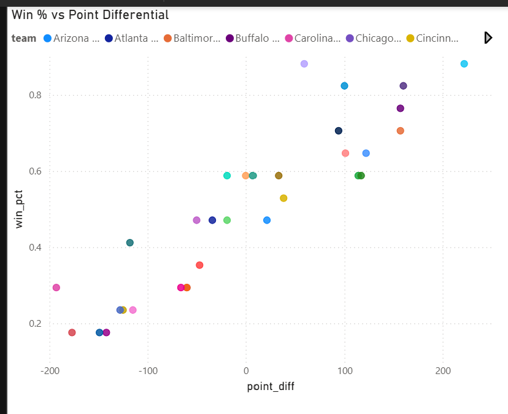

## Key Insights
- Point differential shows a strong positive relationship with win percentage, reinforcing its value as a holistic efficiency metric.
- Points per game also correlates strongly with winning, highlighting offensive consistency as a key driver of team success.
- Together, these metrics explain much of the variance in team win rates across the league.
- Added PowerBi Dashboard

## Dashboard Preview

### Win Percentage vs Point Differential

### Win Percentage vs Points Per Game

